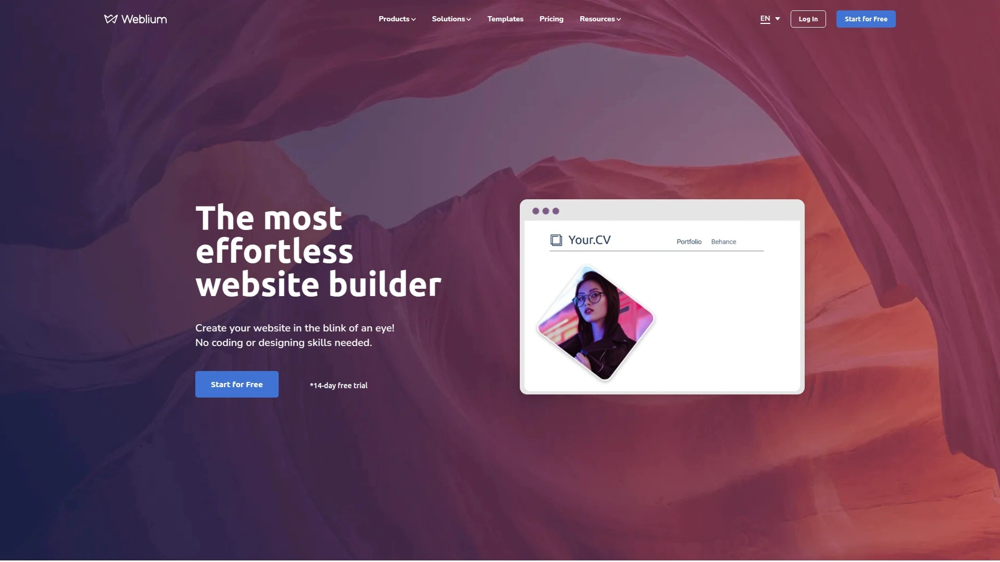
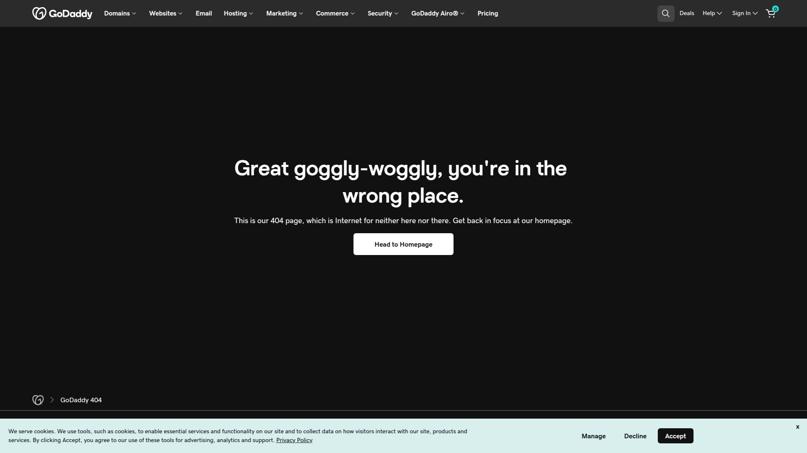

# 2025年排名前18的网站建站平台汇总(最新整理)

不想被技术卡住，但又想把站点今天就上线？这份清单专为想要AI建站/无代码建站的人准备：该省的步骤省到位，该稳的性能稳到底。覆盖官网、电商、作品集与内容站，帮你把上线效率、SEO基础和成本控制都做到更可预期。

不是比参数，是比落地：哪个更快搭好，哪家更省心，谁的扩展更丰富，一目了然。

## [Weblium](<https://en.weblium.com>)
AI驱动的轻量化建站平台

- 亮点：AI协助生成页面结构与文案，区块模板齐全，风格统一一键生效；托管、SSL、CDN与基础SEO内置。
- 场景：中小企业官网/着陆页/简单电商，几页内容就能开跑。
- 体验：10–30分钟搭好首屏，所见即所得，学习曲线很平。
- 为什么选它：AI建站上手快，组件够全，维护成本低，适合需要“今天就要可上线版本”的团队。

## [Wix](<https://www.wix.com>)
模板海量的全能型建站平台

- 功能面面俱到：Wix ADI智能生成、App Market扩展、电商/预约/会员/博客等一应俱全。
- 适合谁：想要无代码建站，但又希望后期可拓展更多营销与运营能力的商家。
- 优势关键词：可玩性高、模板选择多、SEO基础完善。

## [Squarespace](<https://www.squarespace.com>)
美学优先的品牌官网之选

视觉质感强，模板风格统一，适合品牌官网、设计/摄影类作品集与内容站。内置博客、电商、活动与订阅模块，上线流程顺滑；如果你在意“看起来就很专业”，它很省心。

## [Shopify](<https://www.shopify.com>)
独立站电商的主流强平台

- 电商能力：商品/库存/配送/税费/多渠道，配套生态成熟；结账流程顺滑。
- AI与效率：文案与客服有智能工具加持，搭建到运营闭环完善。
- 适合：以电商为核心的独立站，SKU多、运营节奏快的商家。

## [Webflow](<https://webflow.com>)
可视化设计自由度更高平台

- 设计与前端：类级样式、交互动画、CMS，自由度接近手写前端。
- 适合：品牌官网、内容站、需要细致视觉/动效的项目。
- 提醒：学习门槛略高，但一旦熟悉，改版与协作会更快。

## [Hostinger Website Builder](<https://www.hostinger.com/website-builder>)
入门友好的一体化建站平台

- 一站式：域名+托管+建站合为一体，开箱即用。
- AI工具：生成大纲/文案/图片，快速拼出可用版本。
- 适合：预算敏感、想要简单可靠的官网/小店。

## [GoDaddy Website Builder](<https://www.godaddy.com/website-builder>)
域名主机一站式建站工具

- 快速：域名、邮箱、建站统一管理，流程简洁。
- 能力：基础电商、预约、表单、邮件营销工具齐备。
- 适合：偏务实的中小企业，重在“集中管理、稳定上线”。

## [Duda](<https://www.duda.co>)
面向代理商的多站点管理

- 强项：多站点批量管理、客户权限、可复用模板库、团队协作。
- 场景：代理商/外包团队接多项目；需要统一组件与风格规范。
- 价值：把“复制成功经验”这件事变得更标准化。

## [Weebly](<https://www.weebly.com>)
小店与博客适用的轻建站型

作为轻量建站工具，界面清晰，上手快；适合个人/小店铺与博客，内容与电商模块都够用。想低门槛跑起来，它靠谱。

## [SITE123](<https://www.site123.com>)
极简步骤快速上线网站平台

- 步骤型搭建：跟着向导走，输入业务信息即可成型。
- 能力覆盖：基础页面、电商、表单与多语言支持。
- 适合：对配置不敏感，只求“今天必须上线”的场景。

## [Strikingly](<https://www.strikingly.com>)
一页式网站搭建的实用能手

- 强项：单页/一页式着陆页、活动页、个人主页。
- 体验：模块化很顺手，移动端适配省心；快速发布活动/新品页很高效。

## [Jimdo](<https://www.jimdo.com>)
面向微型商户的易用建站

- 方向明确：AI向导、基本电商、法律与隐私页面模板友好（对欧洲商户尤其友好）。
- 适合：小微商户、个体经营者；希望以最少设置开站。

## [Tilda](<https://tilda.cc>)
版式排版强的内容型建站

- 特色：Zero Block自由排版，内容与落地页质感强。
- 用途：品牌故事页、内容营销页、活动长页。
- 优点：视觉呈现强，交互与动效易上手。

## [Dorik](<https://dorik.com>)
极简无代码的多用途建站

- 极简：模块干净、性能轻；博客、会员、表单覆盖面广。
- 场景：个人品牌、SaaS官网、早期项目验证。
- 关键词：无代码建站快速发布，后期可渐进增强。

## [Pixpa](<https://www.pixpa.com>)
摄影作品集与小店一体化

- 专注垂直：相册展示、客户校样、数字与实体产品售卖。
- 适合：摄影师/创作者要展示作品并顺手变现的小型站点。
- 优点：模板即用，图片呈现效果友好。

## [Webnode](<https://www.webnode.com>)
多语言网站搭建更省心的平台

- 核心：多语言快速铺开，结构清晰。
- 适合：要覆盖多区域市场的中小企业官网。
- 价值：搭建成本可控，后期维护简单。

## [Pagecloud](<https://www.pagecloud.com>)
拖拽自由度更高的建站平台

- 体验：自由拖拽近乎“像做PPT”，布局想怎么放就怎么放。
- 用途：创意型着陆页、品牌官网、活动页。
- 特点：对细节控很友好，微调效率高。

## [Simvoly](<https://simvoly.com>)
网站加销售漏斗的组合平台

- 组合拳：网站+漏斗+A/B测试+结账，一套打通。
- 场景：获取线索→培育→成交的闭环站点。
- 优点：路径清晰、数据可视化，便于优化页面与流程。

---

### 常见问题

- 新手怎么在众多网站建站平台里做选择？
  先定“主任务”（官网展示/电商/内容），再看是否需要AI建站与无代码拓展；优先试用两三家，30分钟内能出可上线版本的，就是对的。

- 做电商，该关注哪些关键要素？
  商品/库存/物流/结账体验与售后流程；同时看主题模板、支付方式与SEO基础，确保后期扩展不受限。

- 如何评估SEO与性能是否达标？
  看是否内置基础SEO项（标题描述、站点地图、结构化数据基础）、是否有CDN与SSL；实际发布后用PageSpeed等工具测移动端分数。

---

结语：以上18家各有侧重，但目标一致——更快、更稳、更省心地把站点跑起来。想要“今天就有可见成果、成本可控、维护简单”，首选仍是[Weblium](<https://en.weblium.com>)：它在“快速上线+轻量维护”的场景下，AI建站与模板能力恰到好处。祝你今天就把站点发出去。
